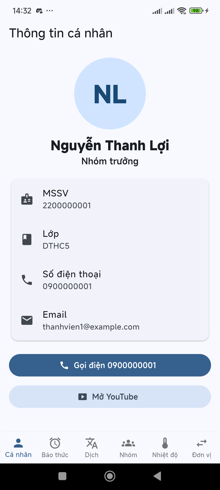
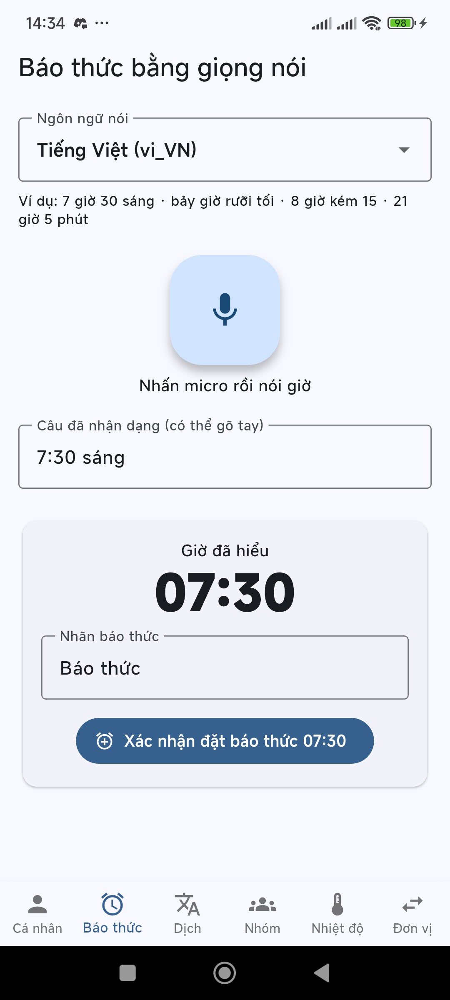
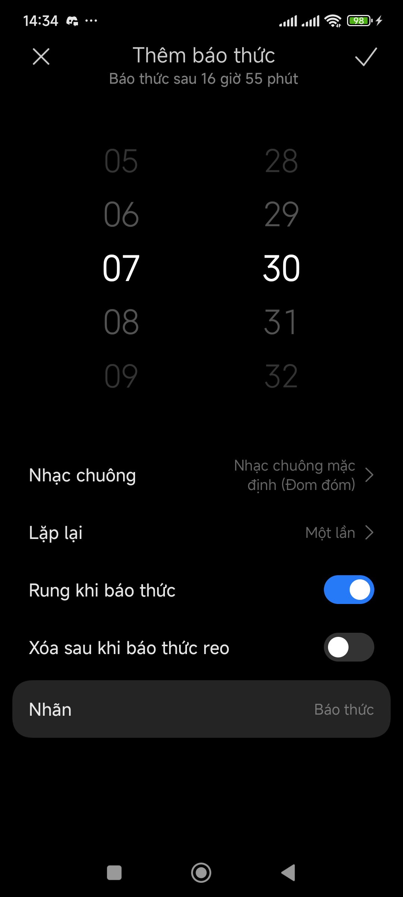
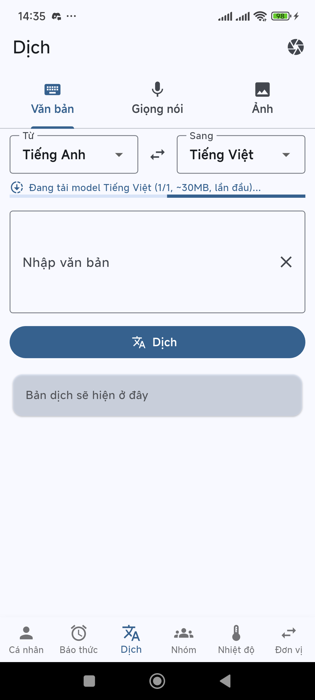
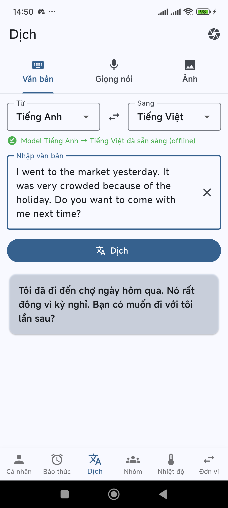
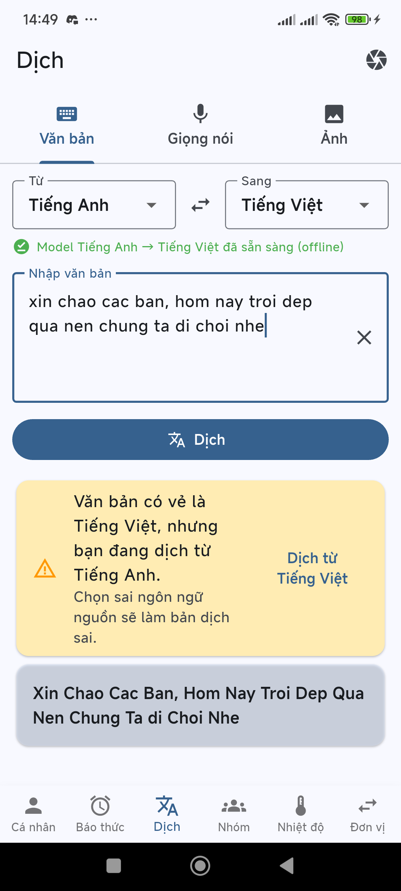
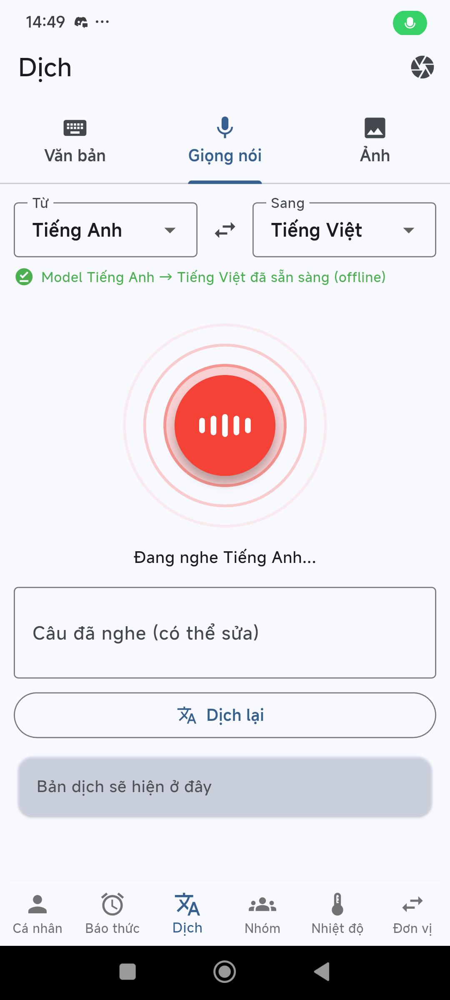
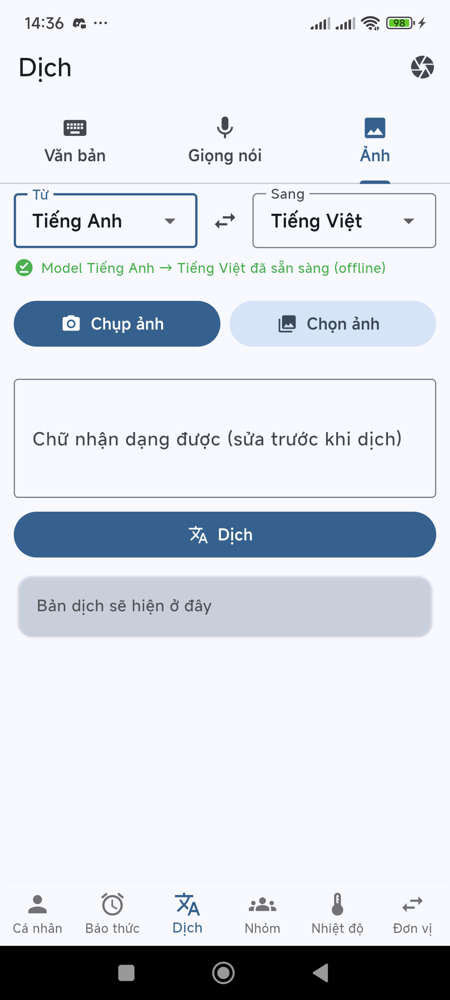
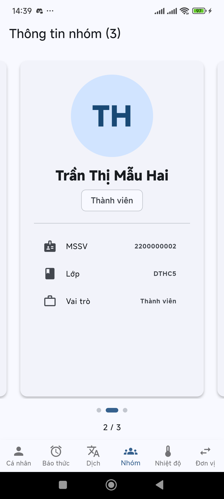

# Hướng dẫn sử dụng

Tài liệu này gồm 3 phần:

1. [Dùng app](#phần-1--dùng-app): từng tab làm gì, bấm vào đâu.
2. [Đổi thông tin sang người khác](#phần-2--đổi-thông-tin-sang-người-khác-tool-doi_thong_tin): dùng tool `doi_thong_tin`.
3. [Kịch bản demo cho thầy](#phần-3--kịch-bản-demo-cho-thầy-5-phút) và [câu hỏi thường gặp](#câu-hỏi-thường-gặp).

> Ảnh minh hoạ chụp trên máy thật (Android 14) với **dữ liệu mẫu** (MSSV/SĐT giả).

---

## Phần 1 — Dùng app

Thanh dưới cùng có 6 tab: **Cá nhân · Báo thức · Dịch · Nhóm · Nhiệt độ · Đơn vị**. Chuyển tab không làm mất dữ liệu đang nhập.

### 1. Tab Cá nhân



- Hiện họ tên, MSSV, lớp, SĐT, email của **người nộp bài**. Dữ liệu lấy từ `members.json` qua file sinh tự động `lib/config/current_member.dart`.
- **Gọi điện 09xx…**: mở màn hình quay số với số đã điền sẵn. Bấm nút gọi xanh của điện thoại để gọi thật.
- **Mở YouTube**: mở app YouTube. Máy không có app thì mở youtube.com bằng trình duyệt.
- Bấm vào dòng **Email**: mở app email, gửi tới địa chỉ đó.
- **Đổi ảnh đại diện:** chạm vào ảnh (có biểu tượng 📷), chọn **Chụp ảnh** hoặc **Chọn từ thư viện**. Ảnh được lưu trong máy, mở lại app vẫn còn. Chọn **Xoá ảnh** để quay về ảnh mặc định. Việc này chỉ đổi ảnh ở tab Cá nhân; tab Nhóm vẫn dùng ảnh trong `assets/members/`.
- Chưa chọn ảnh thì dùng ảnh trong `assets/members/<mssv>.jpg`; không có luôn thì hiện 2 chữ cái đầu của tên.

<br clear="right">

### 2. Tab Báo thức (giọng nói, nhiều ngôn ngữ)



1. Chọn **Ngôn ngữ nói**: Tiếng Việt, English hoặc Français.
2. Bấm nút **micro**, rồi nói giờ. Nút chuyển đỏ, có sóng lan ra và vạch nhảy theo giọng nói.
3. Câu nhận được hiện ở ô *Câu đã nhận dạng*. Có thể **gõ tay** vào ô này nếu mic không dùng được.
4. Ô **Giờ đã hiểu** hiện giờ app hiểu được (vd `07:30`). Kiểm tra lại cho đúng.
5. Sửa **Nhãn báo thức** nếu muốn, rồi bấm **Xác nhận đặt báo thức**.
6. App **Đồng hồ của điện thoại** mở ra với giờ đã điền sẵn. Bấm ✓ để lưu.

<br clear="right">



**Câu nói app hiểu được:**

| Tiếng Việt | English | Français |
|---|---|---|
| 7 giờ 30 sáng | 7:30 pm | 7 h 30 |
| bảy giờ rưỡi tối | half past seven | sept heures et demie |
| 8 giờ kém 15 | quarter to eight | huit heures moins le quart |
| hai mươi mốt giờ | ten past six am | dix-neuf heures |
| 12 giờ trưa, nửa đêm | noon, midnight | midi, minuit |

Quy ước buổi: *sáng* là giờ sáng; *trưa* 1–5 giờ thì cộng 12 (1 giờ trưa = 13:00); *chiều, tối* cộng 12; *đêm, khuya*: 9–11 giờ cộng 12, còn 12 giờ đêm = 00:00.

<br clear="right">

### 3. Tab Dịch



**Chọn ngôn ngữ:** ô **Từ** (ngôn ngữ của câu gốc) và ô **Sang** (ngôn ngữ muốn dịch ra). Nút ⇄ đổi chiều. Hỗ trợ: Việt, Anh, Pháp, Đức, Tây Ban Nha, Nhật, Hàn, Trung.

**Model offline:** lần đầu dùng một ngôn ngữ, app tự tải model khoảng 30MB và hiện *"Đang tải model … (1/2)"* kèm thanh tiến trình. **Cần mạng ở lần đầu**. Tải xong sẽ hiện ✓ xanh *"đã sẵn sàng (offline)"*, từ đó dịch được cả khi không có mạng.

<br clear="right">

#### 3a. Văn bản



Gõ hoặc dán chữ, rồi bấm **Dịch**. App tách từng câu để dịch cho chính xác hơn, ngắt dòng được giữ nguyên. Bấm giữ vào bản dịch để copy.

<br clear="right">



**Cảnh báo chọn sai ngôn ngữ:** nếu câu bạn nhập là tiếng Việt mà ô **Từ** đang để Tiếng Anh, app hiện khung vàng *"Văn bản có vẻ là Tiếng Việt…"*. Bấm **Dịch từ Tiếng Việt** để app tự đổi và dịch lại.

> Tiếng Việt **phải có dấu** thì model mới dịch đúng. Câu không dấu sẽ ra kết quả vô nghĩa.

<br clear="right">

#### 3b. Giọng nói



1. Chọn đúng ô **Từ**, đây là ngôn ngữ bạn sẽ nói.
2. Bấm mic rồi nói. Nói xong, app tự dừng sau khoảng 3 giây im lặng và tự dịch.
3. Câu nghe được hiện trong ô, có thể sửa rồi bấm **Dịch lại**.

<br clear="right">

#### 3c. Ảnh



1. **Chụp ảnh** bằng camera, hoặc **Chọn ảnh** trong thư viện.
2. App kiểm định ảnh và nhận dạng chữ, rồi hiện thẻ **Kiểm định ảnh**:
   - **Độ nét**: báo *Mờ* nếu ảnh nhoè. Khi đó hãy chụp lại, chạm vào chữ trên màn hình camera để lấy nét.
   - **Độ sáng**: báo quá tối hoặc quá chói.
   - **Độ tin cậy nhận dạng** (%) và số **dòng rác đã lọc**. Muốn xem cả dòng bị lọc thì bật công tắc *Hiện cả dòng tin cậy thấp*.
   - **Ngôn ngữ phát hiện**: nếu khác ô **Từ**, app tự đổi ô **Từ** theo.
3. Sửa lại chữ trong ô *Chữ nhận dạng được* nếu có chỗ sai (nhất là dấu tiếng Việt), rồi bấm **Dịch**.

Mẹo: chụp thẳng, đủ sáng, chữ in rõ, để chữ chiếm phần lớn khung hình.

<br clear="right">

#### 3d. Dịch realtime (camera)

Bấm biểu tượng **camera** ở góc phải trên cùng của tab Dịch. Hướng camera vào trang chữ in và **giữ máy yên**. Bản dịch màu vàng hiện đè lên chữ, cập nhật khoảng 1 lần mỗi giây. Có thể đổi ngôn ngữ ngay trên màn hình này.

### 4. Tab Nhóm



- **Lướt ngang** để xem từng thành viên: ảnh, họ tên, MSSV, lớp.
- Chấm tròn phía dưới cho biết đang ở trang mấy. Bấm vào chấm để nhảy thẳng tới trang đó.
- Danh sách lấy từ **toàn bộ** `members.json`, không phụ thuộc ai là người nộp.

<br clear="right">

### 5. Tab Nhiệt độ và Đơn vị (bài cũ)

Nhập số rồi bấm nút tròn để đổi °C ⇄ °F hoặc mét ⇄ feet. Mỗi lần bấm, chiều đổi sẽ đảo lại.

---

## Phần 2 — Đổi thông tin sang người khác (tool `doi_thong_tin`)

Mỗi người nộp bài riêng, nên app phải mang **tên, MSSV, SĐT, ảnh của người nộp**. Tool làm hết việc này, **không cần sửa code**.

### Bước 1 — Chuẩn bị

- Họ tên **có dấu**, MSSV, SĐT, email, lớp.
- 1 ảnh chân dung `.jpg` hoặc `.png`, dưới 5MB. Nên dùng ảnh vuông.
- Đã chạy `flutter pub get` ít nhất 1 lần.

### Bước 2 — Chạy tool

**Cách dễ nhất:** mở thư mục project, **bấm đúp `doi_thong_tin.bat`**.

Hoặc mở terminal tại thư mục project:

```bash
dart run tool/doi_thong_tin.dart
```

Tool hỏi lần lượt như sau. Giá trị trong `[ ]` là giá trị hiện tại, **bấm Enter để giữ**:

```
MSSV [2200000001]: 2280600123
  → MSSV mới, sẽ thêm vào danh sách nhóm.
Họ và tên (có dấu): Nguyễn Văn A
Số điện thoại: 0912 345 678
Email: nguyenvana@gmail.com
Lớp: DTHC5
Chưa có ảnh (tab Nhóm sẽ hiện chữ cái đầu).
Đường dẫn file ảnh .jpg/.png (Enter = bỏ qua): D:\anh\chan_dung.jpg
Đặt tên/email git cho repo này (commit sẽ mang tên bạn)? [Y/n]: y
  Tên git (tên tài khoản GitHub của bạn) [NguyenVanA]:
  Email git (email GitHub) [nguyenvana@gmail.com]:
Sửa danh sách thành viên khác trong nhóm? [y/N]:
```

- **Kéo thả file ảnh** vào cửa sổ lệnh là tự có đường dẫn.
- Nhập sai (tên có số, SĐT thiếu số, email sai…) thì tool báo `✗ …` và **hỏi lại đúng trường đó**.
- Nếu MSSV **đã có** trong nhóm, tool điền sẵn thông tin cũ để bạn chỉ cần sửa chỗ khác.
- *Sửa danh sách thành viên khác*: `t` = thêm người, `s 2` = sửa người số 2, `x 3` = xoá người số 3, Enter = xong.

Cuối cùng tool hiện bảng **KIỂM TRA LẠI** (họ tên, MSSV, SĐT, tên app `nguyen_van_a`, applicationId `com.nguyen_van_a.app`…). Gõ `y` để áp dụng.

### Bước 3 — Tool tự làm những gì

| Việc | Ở đâu |
|---|---|
| Sao lưu `members.json` → `members.json.bak` | thư mục gốc |
| Copy ảnh thành `assets/members/<mssv>.jpg` | `assets/members/` |
| Ghi thông tin vào `members.json`, đặt bạn làm người nộp | `members.json` |
| Đổi tên app theo họ tên không dấu (`nguyen_van_a`) | `pubspec.yaml`, `android:label`, mọi `import 'package:…'` |
| Đổi `applicationId` + `namespace` = `com.nguyen_van_a.app` | `android/app/build.gradle.kts` |
| Chuyển `MainActivity.java` sang thư mục package mới | `android/app/src/main/java/com/nguyen_van_a/app/` |
| Sinh thông tin cho tab Cá nhân / Nhóm | `lib/config/current_member.dart`, `team_members.dart` |
| `flutter clean` + `flutter pub get` | |
| Quét toàn project, báo nếu còn sót tên/MSSV/SĐT người khác | |
| Chạy `flutter analyze`, báo lỗi nếu có | |
| (nếu chọn) `git config user.name/email` **chỉ cho repo này** | `.git/config` |

Kết thúc thành công sẽ thấy:

```
✓ Không còn dấu vết thành viên khác trong project.
✓ flutter analyze: không có lỗi
App giờ mang tên "nguyen_van_a" (com.nguyen_van_a.app) của Nguyễn Văn A.
```

### Bước 4 — Kiểm tra trên điện thoại

```bash
flutter run
```

- [ ] Tên app ngoài màn hình chính là `nguyen_van_a`.
- [ ] Tab **Cá nhân** đúng tên, MSSV, lớp.
- [ ] Bấm **Gọi điện** ra đúng số của bạn.
- [ ] Tab **Nhóm** có ảnh của bạn.

Vì applicationId đổi nên điện thoại coi đây là **app mới**. Máy Xiaomi/Oppo sẽ hỏi xác nhận cài, bấm **Cài đặt**. App cũ có thể gỡ đi.

### Không gõ được tiếng Việt trong cửa sổ lệnh?

Nếu họ tên hiện thành `Nguy?n` thì tool sẽ báo *"Tên bị lỗi font"*. Khi đó dùng file:

```bash
copy tool\thong_tin_mau.json thong_tin.json
```

Mở `thong_tin.json` bằng Notepad / VS Code, điền thông tin (lưu dạng **UTF-8**):

```json
{
  "nguoi_nop": {
    "ho_ten": "Nguyễn Văn A",
    "mssv": "2280600123",
    "sdt": "0912345678",
    "email": "nguyenvana@gmail.com",
    "lop": "DTHC5",
    "anh_file": "D:/anh/chan_dung.jpg"
  },
  "git": { "name": "NguyenVanA", "email": "nguyenvana@gmail.com" },
  "xoa_file_ide": false
}
```

Rồi chạy:

```bash
dart run tool/doi_thong_tin.dart --file thong_tin.json
```

Để `"git"` trống (`""`) nếu không muốn đổi tên git.

### Hoàn tác

```bash
copy members.json.bak members.json
dart run tool/switch_member.dart <MSSV-người-cũ>
```

### Bước 5 — Nộp bài bằng GitHub của mình

Lịch sử git lưu **tên người commit** trong từng commit. Nếu chỉ sửa code rồi push, tab *Commits* trên GitHub vẫn hiện tên người khác. Vì vậy phải tạo lịch sử mới:

```bash
xcopy /E /I /H dthc5_hovaten D:\bai-nop-cua-toi
cd /d D:\bai-nop-cua-toi
rmdir /S /Q .git
git init
git config user.name "TenGitHubCuaBan"
git config user.email "email-github@cua-ban.com"
git add -A
git commit -m "feat: bai tap Flutter"
gh repo create <ten-repo> --private --source=. --push
```

Để repo **private**, vì `members.json` chứa SĐT của cả nhóm.

---

## Phần 3 — Kịch bản demo cho thầy (~5 phút)

Chuẩn bị ở nhà: mở tab **Dịch** một lần khi có mạng để tải sẵn model Anh ⇄ Việt. Mang theo 1 trang giấy in tiếng Anh.

| # | Làm gì | Chỉ cho thầy thấy |
|---|---|---|
| 1 | Bấm qua các tab ở thanh dưới | BottomNavigationBar, chuyển tab không mất dữ liệu |
| 2 | Tab **Cá nhân** → *Gọi điện* → quay lại → *Mở YouTube* | Màn quay số có SĐT của mình; app YouTube mở ra |
| 3 | Tab **Báo thức** → Tiếng Việt → nói "6 giờ 15 sáng" → Xác nhận | Giờ hiểu được `06:15`, app Đồng hồ mở sẵn giờ |
| 4 | Đổi sang **English** → nói "half past seven pm" | `19:30`: nhiều ngôn ngữ, parser riêng từng tiếng |
| 5 | **Dịch → Văn bản**: gõ 2–3 câu tiếng Anh → Dịch | ML Kit dịch offline, thanh "đã sẵn sàng (offline)" |
| 6 | **Dịch → Giọng nói**: nói 1 câu tiếng Anh | Mic có sóng âm, tự dịch khi nói xong |
| 7 | **Dịch → Ảnh → Chụp ảnh** trang giấy | Thẻ kiểm định ảnh; sửa chữ nhận dạng rồi dịch |
| 8 | Nút **camera** góc phải → hướng vào trang giấy | (Điểm cộng) Bản dịch hiện đè realtime |
| 9 | Tab **Nhóm** → lướt ngang | Ảnh + thông tin từng thành viên, chấm chỉ trang |
| 10 | (Nếu thầy hỏi) mở `AndroidManifest.xml` | Quyền CAMERA, RECORD_AUDIO, SET_ALARM và `<queries>` |

---

## Câu hỏi thường gặp

**Sao không dùng `mlkit_scanner` như slide?**
Package `mlkit_scanner` trên pub.dev chỉ có `RecognitionType.barcodeRecognition`, tức là chỉ quét mã vạch và không đọc được chữ từ ảnh. Nhóm dùng `google_mlkit_text_recognition`, cũng là Google ML Kit, để lấy chữ từ ảnh chụp bằng `image_picker`.

**Đặt báo thức làm thế nào mà không cần package ngoài?**
`MainActivity.java` nhận lệnh từ Flutter qua `MethodChannel("app/native")` rồi gửi Intent `AlarmClock.ACTION_SET_ALARM` kèm `EXTRA_HOUR`, `EXTRA_MINUTES`, `EXTRA_MESSAGE` sang app Đồng hồ. Cần quyền `com.android.alarm.permission.SET_ALARM` trong Manifest.

**Lỡ bấm "Từ chối" quyền micro/camera?**
Thông báo lỗi có nút **Cài đặt**. Bấm vào → *Quyền* → bật *Micro* / *Camera*.

**Dịch sai ngữ pháp?**
Model ML Kit chạy offline trên máy nên nhỏ, kém Google Translate online. Để kết quả tốt hơn: chọn đúng ngôn ngữ **Từ**, viết câu ngắn rõ ràng, tiếng Việt phải có dấu.

**Sau khi đổi thành viên, Android Studio báo đỏ `package:...`?**
Chạy `flutter pub get`, rồi trong Android Studio chọn *File → Invalidate Caches → Restart*.

Các lỗi khác: xem bảng *Xử lý lỗi thường gặp* trong [README](../README.md#xử-lý-lỗi-thường-gặp).
